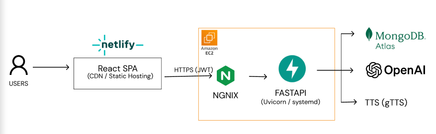

# SOSAI 시스템 아키텍처

## 아키텍처 다이어그램



## 상세 아키텍처 트리

```
Users
 │
 ▼
Netlify (https://sosaii.netlify.app)
 └─ React SPA (Static Hosting / CDN)
    ├─ LoginPage (/login)
    ├─ SignupPage (/signup)
    ├─ VoicePage (/voice)
    │   ├─ 음성인식 (Web Speech API)
    │   └─ 텍스트 입력
    ├─ CallPage (/call)
    │   ├─ 위치정보 (Geolocation API)
    │   ├─ 카카오맵 연동
    │   └─ 119 전화 연결
    ├─ Medical (/medical)
    │   └─ 의료 프로필 관리
    └─ Settings (/settings)
        │ HTTPS REST API
        │ Authorization: Bearer {JWT}
        ▼
AWS EC2 (Ubuntu)
 ├─ NGINX (Reverse Proxy)
 │   └─ SSL/TLS 종료
 │   └─ 요청 라우팅
 │   └─ 정적 파일 서빙
 │
 └─ FastAPI (Uvicorn / systemd)
    ├─ CORS Middleware
    │   └─ Allowed Origins: sosaii.netlify.app
    │
    ├─ Routes: /auth
    │   ├─ POST /auth/signup
    │   │   ├─ 사용자 생성 (MongoDB)
    │   │   ├─ 의료 프로필 초기화
    │   │   └─ JWT 토큰 발급
    │   └─ POST /auth/login
    │       ├─ 인증 검증
    │       └─ JWT 토큰 발급
    │
    ├─ Routes: /medical
    │   ├─ GET /medical
    │   │   └─ JWT 검증 → 의료 프로필 조회
    │   └─ PUT /medical
    │       └─ JWT 검증 → 의료 프로필 저장
    │
    ├─ Routes: /dialog
    │   └─ POST /dialog
    │       ├─ JWT 토큰 추출 (선택적)
    │       ├─ 의료 프로필 로드 (개인화)
    │       ├─ OpenAI LLM 호출
    │       │   ├─ System Prompt (응급 가이드 원칙)
    │       │   ├─ User Question
    │       │   └─ Medical Profile (있으면)
    │       ├─ TTS 생성 (gTTS)
    │       └─ 응답 반환 (answer, audio_url)
    │
    ├─ Routes: /tts
    │   └─ POST /tts
    │       └─ 텍스트 → MP3 변환 (gTTS)
    │
    └─ Static Files
        └─ /static/*.mp3 (TTS 오디오 파일)
        │
        │ Motor (Async MongoDB Driver)
        │ TLS Connection
        ▼
MongoDB Atlas (Cloud NoSQL)
 ├─ Database: sosai
 │   ├─ Collection: users
 │   │   ├─ email (unique)
 │   │   ├─ password_hash
 │   │   ├─ name
 │   │   └─ created_at
 │   │
 │   └─ Collection: medical_profiles
 │       ├─ user_id (unique index)
 │       ├─ name
 │       ├─ birth_date
 │       ├─ blood_type
 │       ├─ medical_history
 │       ├─ surgery_history
 │       ├─ medications
 │       ├─ allergies
 │       ├─ emergency_contacts
 │       ├─ created_at
 │       └─ updated_at
        │
        │ OpenAI API
        │ HTTPS
        ▼
OpenAI API
 └─ GPT-4.1-mini (또는 Prompt ID)
    ├─ System Prompt: 응급 상황 대응 가이드라인
    ├─ User Input: 질문 + 의료 프로필
    └─ Response: 구조화된 응급 안내
        │
        │ Google gTTS API
        │ HTTPS
        ▼
Google Text-to-Speech (gTTS)
 └─ 한국어 음성 변환
    └─ MP3 파일 생성
```

## 주요 데이터 흐름

### 1. 사용자 인증 흐름
```
User → Netlify (LoginPage)
  → POST /auth/login (HTTPS)
  → AWS EC2
    └─ NGINX (Reverse Proxy)
      └─ FastAPI (비밀번호 검증)
        └─ MongoDB (users 컬렉션 조회)
          └─ JWT 토큰 생성
            └─ localStorage 저장
```

### 2. 응급 상황 대응 흐름
```
User → Netlify (VoicePage)
  → 음성인식 또는 텍스트 입력
  → POST /dialog (HTTPS, Bearer Token 포함)
  → AWS EC2
    └─ NGINX (Reverse Proxy)
      └─ FastAPI
        ├─ JWT 검증 (선택적)
        ├─ MongoDB (medical_profiles 조회)
        ├─ OpenAI API 호출
        │   └─ 개인화된 응급 가이드 생성
        ├─ gTTS (음성 변환)
        └─ 응답 반환 (answer, audio_url)
  → React (응답 표시 + 오디오 재생)
```

### 3. 의료 프로필 관리 흐름
```
User → Netlify (Medical Page)
  → GET /medical (HTTPS, Bearer Token)
  → AWS EC2
    └─ NGINX (Reverse Proxy)
      └─ FastAPI (JWT 검증)
        └─ MongoDB (medical_profiles 조회)
          └─ 프로필 표시
            └─ PUT /medical (수정)
              └─ MongoDB (저장)
```

## 보안 및 운영

- **NGINX**: 리버스 프록시, SSL/TLS 종료, 요청 라우팅
- **CORS**: Netlify 도메인만 허용
- **JWT**: HS256 알고리즘, 환경변수로 관리
- **비밀번호**: bcrypt 해싱
- **환경변수**: `/etc/sosai.env` 파일로 분리
- **서비스 관리**: systemd (자동 재시작)
- **HTTPS**: 모든 통신 암호화 (NGINX에서 SSL 종료)

## 배포 환경

- **Frontend**: Netlify (자동 배포 via GitHub, CDN/Static Hosting)
- **Backend**: AWS EC2 (Ubuntu)
  - **NGINX**: 리버스 프록시 및 웹 서버
  - **FastAPI**: Uvicorn ASGI 서버, systemd로 관리
- **Database**: MongoDB Atlas (Cloud NoSQL)
- **External APIs**: 
  - OpenAI (LLM 응급 가이드 생성)
  - Google Text-to-Speech (gTTS, 음성 변환)

## 아키텍처 특징

- **프론트엔드-백엔드 분리**: React SPA와 FastAPI 완전 분리
- **리버스 프록시**: NGINX를 통한 요청 라우팅 및 SSL 종료
- **비동기 처리**: FastAPI + Motor (비동기 MongoDB 드라이버)
- **개인화**: JWT 기반 인증 및 의료 프로필 기반 맞춤 응답
- **확장성**: 클라우드 기반 인프라로 수평 확장 가능
