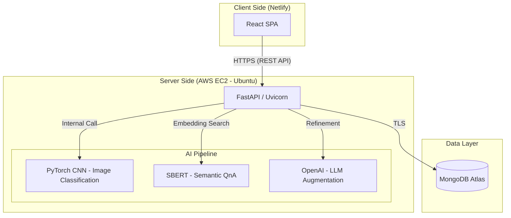

# SOSAI  
**AI 기반 응급 상황 대응 및 지능형 음성 가이드 시스템**

🔗 **Service URL**: https://sosaii.netlify.app/

---

## Project Overview

SOSAI는 응급 상황을 대상으로  
**자연어 질의응답 + 음성 안내(TTS)** 를 결합한 AI 기반 응급 대응 시스템이다.
사용자가 입력한 기본 신체 정보(연령, 성별 등)를 참고하여 응급 상황 판단을 보조하고 **단계적 행동 지침을 텍스트와 음성(TTS)**으로 제공한다.

본 프로젝트는 단순한 데모가 아닌,
실제 배포 환경: Netlify(FE) & AWS EC2(BE) 기반의 안정적 운영
LLM 보강 구조: 데이터 기반 답변을 OpenAI LLM이 자연스러운 음성 가이드로 재가공하는 기능을 가지고 있다.


## LLM 응급 가이드 설계 원칙
SOSAI의 LLM은 의료 진단을 수행하지 않으며, 다음 원칙을 철저히 준수하도록 프롬프트 레벨에서 제어된다.


1. 생명 위협 징후(의식 소실, 호흡 곤란, 심한 출혈, 경련, 반응 없음 등)가 감지되면
2. 즉시 “119에 신고하세요”를 최우선으로 안내
3. 모든 안내는 짧고 명확한 단계별 행동 지침으로 제공
4. 상황 확인 질문을 지속적으로 수행
5. 예: “지금 의식이 있나요?”, “증상이 변했나요?”
6. 전문 의학 용어 사용 최소화 (필요 시 짧은 설명 병기)
7. 판단이 불명확한 경우 반드시 **“정확한 처치를 위해 전문 의료진의 도움이 필요합니다”**를 명시 추가 정보가 필요한 경우, 충분한 확인 후 응답


 ---
   

## 2. 전체 아키텍처 (High-Level Architecture)




## Tech Stack

### Frontend

| 항목 | 기술 |
|---|---|
| Framework | React (SPA) |
| Hosting | Netlify |
| CI/CD | GitHub 연동 자동 배포 |
| Security | HTTPS (Netlify SSL) |

### Backend

| 항목 | 기술 |
|---|---|
| Framework | FastAPI (Python) |
| ASGI Server | Uvicorn |
| Infrastructure | AWS EC2 (Ubuntu) |
| Service Management | systemd |


### AI & Data

| 항목 | 기술 |
|---|---|
| Database | MongoDB Atlas (Cloud NoSQL) |
| Usage | 응급 QnA 데이터, 요청 로그 저장 |
| NLP Search | Sentence-BERT 기반 임베딩 검색 |


### systemd Service Configuration
```ini
[Unit]
Description=SOSAI FastAPI Service
After=network.target

[Service]
User=ubuntu
WorkingDirectory=/home/ubuntu/OPENSOURCECOLABO/backend
EnvironmentFile=/etc/sosai.env
ExecStart=/home/ubuntu/OPENSOURCECOLABO/backend/venv/bin/uvicorn main:app --host 0.0.0.0 --port 8000
Restart=always
RestartSec=3

[Install]
WantedBy=multi-user.target
```
---

## Operation & Security

1. CORS Policy : `sosaii.netlify.app` 도메인만 API 접근 허용
2. Environment Variables : API Key 및 DB URI를 `/etc/sosai.env` 파일에 분리 저장하여 보안 강화
3. Stability : `systemd`의 `Restart=always` 설정으로 서버 재부팅 및 비정상 종료 시 자동 복구


---


**저작권 및 라이선스 안내**

본 프로젝트의 소스코드 및 데이터는 오픈소스 목적으로 작성되었으며, MIT License를 따릅니다.

자유롭게 수정, 배포 및 상업적 이용이 가능합니다.

단, 외부 TTS API(Google gTTS 등) 사용 시 해당 서비스의 약관을 준수해야 합니다.

Copyright (c) 2025 OPENSOURCECOLABO
